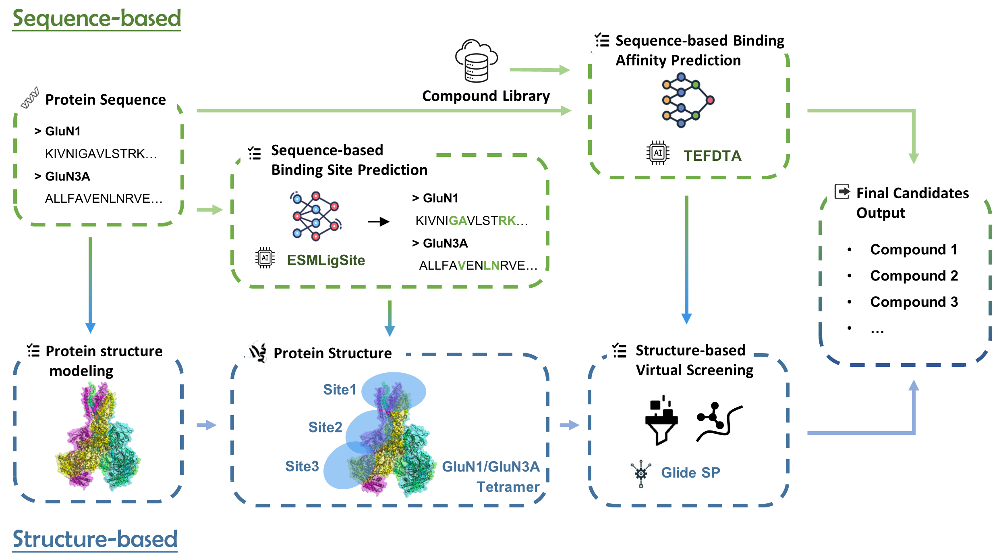
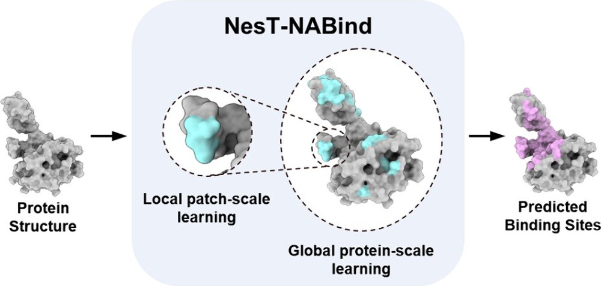

Hi there! My name is Xinyue Ma (马欣悦). I am currently a third-year Ph.D student in Computer Science and Technology at <a href="https://www.shanghaitech.edu.cn/">ShanghaiTech University</a>, supervised by <a href="https://bailab.siais.shanghaitech.edu.cn/">Prof. Fang Bai</a>. I received my bachelor's degree in Biomedical Engineering from ShanghaiTech University in 2022.

My research interests focus on <b>Artificial Intelligence-Driven Drug Design(AIDD)</b>, including:
- <b>AI methods for protein-nucleic acid interactions</b>: the binding site prediction and generation of nucleic acids.
- <b>Protein representation learning</b>, especially geometric representation based on protein structure.

Publications
======
\* indicates equal contributions.

**_Discovery of Selective GluN1/GluN3A NMDA Receptor Inhibitors Using Integrated AI and Physics-Based Approaches._** \
Shiwei Li\*, Yue Zeng\*, Sanan Wu\*, **Xinyue Ma\***, Chao Xu\*, Zongquan L\*, Sui Fang, Xueqin Chen, Zhaobing Gao, Fang Bai \
_Acta Pharmacologica Sinica, 2025 (Accepted)_ \
 

**_NesT-NABind: a Nested Transformer for Nucleic Acid-Binding Site Prediction on Protein Surface._** [Paper](https://pubs.acs.org/doi/10.1021/acs.jcim.4c01765) \
**Xinyue Ma**, Fenglei Li, Qianyu Chen, Shenghua Gao, Fang Bai \
_Journal of Chemical Information and Modeling, 2025_ \
 \

**_Recent Advances in Molecular Representation Methods and Their Applications in Scaffold Hopping._** \
Shihang Wang, Ran Zhang, Xiangcheng Li, Fengyu Cai, **Xinyue Ma** , et al. \
_npj Drug Discovery, 2025(Accepted)_ \

**_PPI-Miner: A Structure and Sequence Motif Co-Driven Protein-Protein Interaction Mining and Modeling Computational Method._** [Paper](https://pubs.acs.org/doi/10.1021/acs.jcim.2c01033) 
\
Lin Wang, Fenglei Li, **Xinyue Ma**, Yong Cang, Fang Bai \
_Journal of Chemical Information and Modeling, 2022_ \

**_DeepPROTACs is a deep learning-based targeted degradation predictor for PROTACs._** [Paper](https://www.nature.com/articles/s41467-022-34807-3)
\
Fenglei Li, Qiaoyu Hu, Xianglei Zhang, Renhong Sun, Zhuanghua Liu, Sanan Wu, Siyuan Tian, **Xinyue Ma**, et al. \
_Nature Communications, 2022_ \

Talks and Posters
======
- Hainan
- shanghaitech fl
- acs

Awards
======
- sf
- nmda
- poster

Experience
======
**Teaching Assistant**: Biomedical Statistics (Fall 2022, Spring 2023, Fall 2024)
